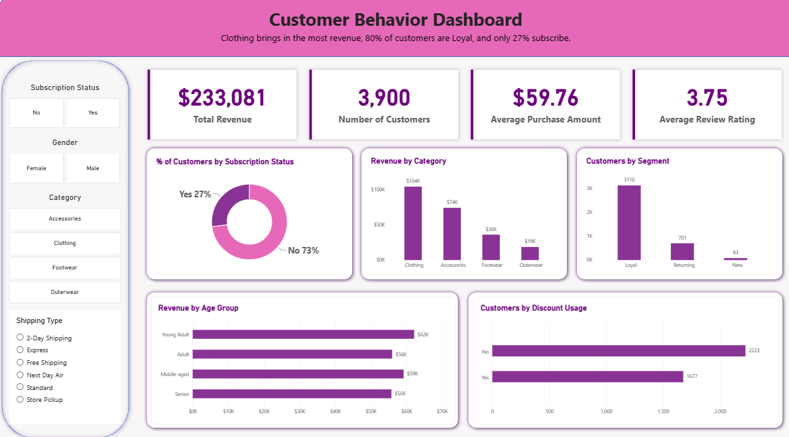
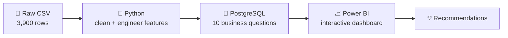

# 🛍️ Customer Shopping Behavior Analysis


**3,900 purchases. $233K in revenue. One surprising answer to "who spends the most?"** 🕵️

> ⏱️ **Short on time?** Spending is almost identical across subscribers, age groups, and shipping types, so targeting "big spenders" won't grow revenue. The real gap is acquisition: **3,116 Loyal customers vs. only 83 New ones.** Jump to [the plot twist](#-the-plot-twist) or [my recommendations](#-what-id-recommend).



## 📊 At a glance

| 💰 Revenue | 🧑‍🤝‍🧑 Customers | 🧾 Avg. Purchase | ⭐ Avg. Rating |
|:---:|:---:|:---:|:---:|
| **$233,081** | **3,900** | **$59.76** | **3.75** |

## 🎬 The plot twist

> [!IMPORTANT]
> **Almost nobody spends differently.** Subscribers, every age group, and both shipping types all land within a couple of dollars of each other. So the usual playbook of "find the big spenders and target them" wouldn't work here.

| Slice | Average spend |
|---|---|
| 🔔 Subscribers vs. non-subscribers | $59.49 vs $59.87 |
| 🎂 Youngest vs. oldest age group | $60.45 vs $59.07 |
| 🚚 Express vs. Standard shipping | $60.48 vs $58.46 |

**So where's the growth?** 👀 In the customer base itself:

- 🏆 **3,116** customers are Loyal (11+ previous purchases)
- 🔁 **701** are Returning
- 🌱 **83** are New

The business is great at keeping customers and weak at finding new ones.

## 🧭 How I got there



| Step | What I did |
|---|---|
| 🐍 **Python** | Cleaned the data, handled missing values, built `age_group` and `purchase_frequency_days` |
| 🐘 **SQL** | CTEs, window functions, subqueries, and conditional aggregation |
| 📈 **Power BI** | KPI cards, 5 charts, and slicers for subscription, gender, category, and shipping |

### 🧠 Decisions I made (and why)

Analysis is mostly judgment calls, so here are mine:

- **Missing ratings (37 rows, ~1%):** filled with the *median per category* instead of dropping rows or using one global value, so each product type keeps its own rating baseline.
- **Promo code column:** I checked that `discount_applied` and `promo_code_used` matched in every row before dropping one, rather than assuming they were duplicates.
- **Age groups:** used quartiles (`pd.qcut`) so each group has roughly the same number of customers, which keeps revenue comparisons fair.
- **Customer segments:** New = 1 previous purchase, Returning = 2 to 10, Loyal = 11+. These cutoffs are my own, and they put 80% of customers in Loyal, so I treat the *gap* between segments as the insight rather than the exact percentages.

## 🔍 10 questions, 10 answers

| # | Question | Answer |
|---|---|---|
| 1 | 👫 Revenue by gender? | Male customers bring in about 68% ($157,890 vs $75,191) |
| 2 | 🏷️ Do discount users still spend big? | Yes, 839 spent above the $59.76 average even with a discount |
| 3 | ⭐ Best-rated products? | Gloves (3.86), Sandals, Boots, but all within 0.08 of each other |
| 4 | 🚚 Express vs. Standard? | About a $2 gap, so shipping isn't a driver |
| 5 | 🔔 Do subscribers spend more? | No, $59.49 vs $59.87 |
| 6 | 💸 Most-discounted products? | Hat (50%) and Sneakers (49.7%), but all top 5 sit near half |
| 7 | 🌱 New vs. Loyal? | 83 New, 701 Returning, 3,116 Loyal |
| 8 | 🥇 Top products per category? | Jewelry, Blouse, Pants, Sandals, Jacket, all very close |
| 9 | 🔁 Do repeat buyers subscribe? | Slightly more: 27.6% vs 22.4% |
| 10 | 🎂 Revenue by age? | Young Adults lead ($62K) but spend is nearly equal across groups |

My favorite query, the top 3 products per category using a window function:

```sql
WITH item_counts AS (
    SELECT category, item_purchased,
           COUNT(customer_id) AS total_orders,
           ROW_NUMBER() OVER (
               PARTITION BY category
               ORDER BY COUNT(customer_id) DESC
           ) AS item_rank
    FROM customer
    GROUP BY category, item_purchased
)
SELECT item_rank, category, item_purchased, total_orders
FROM item_counts
WHERE item_rank <= 3
ORDER BY category, item_rank;
```

All 10 queries: [`customer_behavior_sql_queries.sql`](customer_behavior_sql_queries.sql)

## 🚀 What I'd recommend

1. 🌱 **Grow the New customer base** with a first-purchase incentive. *Measure:* number of New customers over time.
2. 🔔 **Redesign subscriptions** so they encourage bigger baskets, since they don't today. *Measure:* subscriber vs. non-subscriber spend after the change.
3. 🧪 **Test discounts before extending them** by reducing one or two and watching sales. *Measure:* units and revenue per product, with and without the discount.
4. 👕 **Double down on Clothing** ($104K of the $233K) and investigate why Outerwear lags ($19K). *Measure:* revenue by category over time.
5. 🎯 **Segment by behavior, not age**, since age tells us almost nothing. *Measure:* campaign results for behavioral vs. age-based targeting.

## 🔭 What I'd do next

With more data, I'd go further:

- 📅 **Add purchase dates** to see trends, seasonality, and whether customers come back more often
- 💵 **Add cost and original price data** to find out whether discounts actually hurt profit
- 🧪 **Run an A/B test** on the first-purchase incentive instead of just recommending it

## ⚠️ Honest limitations

- 📅 No dates in the data, so no trends over time
- 💵 No cost or original price data, and it's unclear whether purchase amount is before or after the discount
- 📏 Segment cutoffs are my own choice
- 🔗 These are patterns, not proven causes

## 🧰 Skills demonstrated

| Area | What I used |
|---|---|
| 🐍 **Python** | pandas, data cleaning, imputation, feature engineering, SQLAlchemy |
| 🐘 **SQL (PostgreSQL)** | CTEs, window functions, subqueries, `CASE`, aggregation, `GROUP BY` |
| 📈 **Power BI** | KPI cards, interactive slicers, dashboard design, DAX-ready data model |
| 🗣️ **Business thinking** | Turning findings into testable recommendations with success metrics |
| 📝 **Communication** | Written report, dashboard, and this README |

## 📁 What's in this repo

| File | What it is |
|---|---|
| 📓 [`customer_shopping_behavior.ipynb`](customer_shopping_behavior.ipynb) | Cleaning and feature engineering |
| 🗄️ [`customer_behavior_sql_queries.sql`](customer_behavior_sql_queries.sql) | The 10 SQL queries |
| 📄 [`customer_shopping_behavior_report.pdf`](customer_shopping_behavior_report.pdf) | The full write-up |
| 🖼️ [`customer_shopping_behavior_dashboard_overview.png`](customer_shopping_behavior_dashboard_overview.png) | Dashboard screenshot |

<details>
<summary>🛠️ Run it yourself</summary>

The dataset (18 columns) is too big to host here. **[Add dataset source link here.]** Save it as `customer_shopping_behavior.csv` next to the notebook.

```bash
pip install pandas sqlalchemy psycopg2-binary jupyter
```

Create a PostgreSQL database called `customer_behavior`, add your own credentials in the notebook's connection cell (don't commit them), run the notebook, then run the SQL file. Connect Power BI to the `customer` table to rebuild the dashboard.

</details>

## 👋 About me

Hi, I'm **Imane Khtib**, a data analyst who likes turning messy data into clear decisions. This project is how I work: clean the data, ask sharp questions, and end with recommendations someone can actually test.

📧 **Let's talk:** [khtibimane23@gmail.com](mailto:khtibimane23@gmail.com)

⭐ If this was useful, a star is always appreciated!
