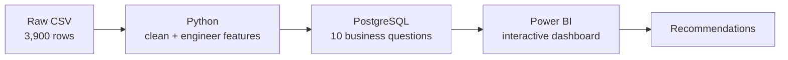

# Customer Shopping Behavior Analysis


**3,900 purchases. $233K in revenue. One question: what drives spending and loyalty?**

> **Short on time?** In this dataset, average spend is almost identical across subscribers, age groups, genders, and shipping types, so there is no obvious "big spender" group to target. The most interesting pattern is in the customer base itself: **3,116 Loyal customers vs. only 83 New ones** under my segment definitions. I treat that as something to investigate, not a proven problem (see [limitations](#limitations)). Jump to [the key finding](#key-finding-almost-nobody-spends-differently) or [my recommendations](#what-id-recommend).


> [!NOTE]
> **About the data.** This is a public retail dataset I downloaded online (the CSV is included in this repo). I did not record the original source link. It has no dates, and spending is so uniform across groups that it may be synthetic. I treat this project as practice in method: cleaning, SQL, dashboarding, and careful reasoning about what the data can and cannot say.

## At a glance

| Revenue | Customers | Avg. Purchase | Avg. Rating |
|:---:|:---:|:---:|:---:|
| **$233,081** | **3,900** | **$59.76** | **3.75** |

## Key finding: almost nobody spends differently

Subscribers, every age group, both genders, and both shipping types all land within about a dollar or two of each other.

| Slice | Average spend |
|---|---|
| Subscribers vs. non-subscribers | $59.49 vs $59.87 |
| Youngest vs. oldest age group | $60.45 vs $59.07 |
| Express vs. Standard shipping | $60.48 vs $58.46 |
| Male vs. female customers | $59.54 vs $60.25 |

**A note on gender.** Male customers bring in 68% of revenue ($157,890 vs $75,191), but they are also 68% of customers (2,652 of 3,900). The revenue gap comes from how many customers there are, not from how much each one spends.

So the usual playbook of "find the big spenders and target them" wouldn't work here.

**Where might growth be?** One place to look is the customer base itself:

- **3,116** customers are Loyal (11+ previous purchases)
- **701** are Returning (2 to 10)
- **83** are New (1)

This suggests the business is good at keeping customers and may be weak at finding new ones. But `previous_purchases` ranges from 1 to 50 with a median of 25, so most customers land in "Loyal" under almost any cutoff I could pick. I read this as a hypothesis worth testing, not a conclusion.

## How I got there



| Step | What I did |
|---|---|
| **Python** | Cleaned the data, handled missing values, built `age_group` and `purchase_frequency_days` |
| **SQL** | CTEs, window functions, subqueries, and conditional aggregation |
| **Power BI** | KPI cards, 5 charts, and slicers for subscription, gender, category, and shipping type; measures written in DAX |

### Decisions I made (and why)

- **Missing ratings (37 rows, about 1%):** filled with the *median per category* instead of dropping rows or using one global value, so each product type keeps its own rating baseline.
- **Promo code column:** I checked that `discount_applied` and `promo_code_used` matched in every row before dropping one, rather than assuming they were duplicates.
- **Age groups:** used quartiles (`pd.qcut`) so each group has roughly the same number of customers, which keeps revenue comparisons fair.
- **Customer segments:** New = 1 previous purchase, Returning = 2 to 10, Loyal = 11+. These cutoffs are my own and they put 80% of customers in Loyal, so I focus on the *gap* between segments rather than the exact percentages.

## 10 questions, 10 answers

| # | Question | Answer |
|---|---|---|
| 1 | Revenue by gender? | Male customers bring in about 68% ($157,890 vs $75,191), but they are also 68% of customers, so average spend is nearly equal |
| 2 | Do discount users still spend big? | About half of discount users (839 of 1,677) still spent above the $59.76 average |
| 3 | Best-rated products? | Gloves (3.86), Sandals, Boots, but all top 5 are within 0.08 of each other |
| 4 | Express vs. Standard? | About a $2 gap, so shipping isn't a driver |
| 5 | Do subscribers spend more? | No, $59.49 vs $59.87 |
| 6 | Most-discounted products? | Hat (50.0%) and Sneakers (49.7%), but all top 5 sit near half |
| 7 | New vs. Loyal? | 83 New, 701 Returning, 3,116 Loyal (cutoffs are my own) |
| 8 | Top products per category? | Jewelry, Blouse, Pants, Sandals, Jacket, all very close (145 to 171 orders) |
| 9 | Do repeat buyers subscribe? | Slightly more: 27.6% vs 22.4% (the non-repeat group is small, 424 customers) |
| 10 | Revenue by age? | Young Adults lead ($62K) but average spend is nearly equal across groups |

My favorite query, the top 3 products per category using a window function:

```sql
WITH item_counts AS (
    SELECT category, item_purchased,
           COUNT(customer_id) AS total_orders,
           ROW_NUMBER() OVER (
               PARTITION BY category
               ORDER BY COUNT(customer_id) DESC
           ) AS item_rank
    FROM customer
    GROUP BY category, item_purchased
)
SELECT item_rank, category, item_purchased, total_orders
FROM item_counts
WHERE item_rank <= 3
ORDER BY category, item_rank;
```

All 10 queries: [`customer_behavior_sql_queries.sql`](customer_behavior_sql_queries.sql)

## What I'd recommend

These follow from the findings above. Each one is meant to be tested before being rolled out.

1. **Investigate and test growing the New customer base,** for example with a first-purchase incentive. *Measure:* number of New customers over time.
2. **Rethink what a subscription offers.** Only 27% subscribe and subscribers don't spend more, so test benefits that encourage larger baskets. *Measure:* subscriber vs. non-subscriber spend after the change.
3. **Test discounts before extending them** by reducing one or two heavily discounted products and watching sales. *Measure:* units and revenue per product, with and without the discount.
4. **Build on what already leads.** Clothing brings in $104K of the $233K (1,737 of the 3,900 purchases), and Outerwear is lowest at $19K, so look into what holds it back. *Measure:* revenue by category over time.
5. **Segment by behavior, not age,** since age tells us almost nothing here. *Measure:* campaign results for behavioral vs. age-based targeting.

## What I'd do next

- **Add purchase dates** to see trends, seasonality, and whether customers return more often
- **Add cost and original price data** to find out whether discounts actually hurt profit
- **Run an A/B test** on the first-purchase incentive instead of just recommending it
- **Repeat the analysis on real transaction data** to check whether these patterns hold

## Limitations

- **No dates.** There is a `Season` column but no purchase dates, so no trends over time.
- **Possibly synthetic data.** Spending is so uniform across groups that the dataset may be computer-generated, so findings may not reflect real customers.
- **Segment cutoffs are my choice.** With `previous_purchases` ranging from 1 to 50, different cutoffs would change segment sizes a lot.
- **No cost or original price data,** and it's unclear whether purchase amount is before or after the discount.
- **Unequal group sizes in Q9** (3,476 repeat buyers vs. 424 others), so that comparison is less stable.
- **Patterns, not causes.** These are relationships in one dataset, not proof that subscriptions, discounts, or shipping change spending.

## Skills demonstrated

| Area | What I used |
|---|---|
| **Python** | pandas, data cleaning, imputation, feature engineering, SQLAlchemy |
| **SQL (PostgreSQL)** | CTEs, window functions, subqueries, `CASE`, aggregation, `GROUP BY` |
| **Power BI** | KPI cards, interactive slicers, dashboard design, DAX measures |
| **Business thinking** | Turning findings into testable recommendations with success metrics |
| **Communication** | Written report, slide deck, dashboard, and this README |

## What's in this repo

| File | What it is |
|---|---|
| [`customer_shopping_behavior.csv`](customer_shopping_behavior.csv) | The dataset (3,900 rows, 18 columns) |
| [`customer_shopping_behavior.ipynb`](customer_shopping_behavior.ipynb) | Cleaning and feature engineering |
| [`customer_behavior_sql_queries.sql`](customer_behavior_sql_queries.sql) | The 10 SQL queries |
| [`customer_behavior_dashboard.pbix`](customer_behavior_dashboard.pbix) | The Power BI dashboard file |
| [`customer_shopping_behavior_dashboard_overview.png`](customer_shopping_behavior_dashboard_overview.png) | Dashboard screenshot |
| [`customer_shopping_behavior_report.pdf`](customer_shopping_behavior_report.pdf) | The full written report |
| [`customer_shopping_behavior_slides.pdf`](customer_shopping_behavior_slides.pdf) | The slide deck |

<details>
<summary>Run it yourself</summary>

```bash
pip install pandas sqlalchemy psycopg2-binary jupyter
```

The dataset is already in this repo as `customer_shopping_behavior.csv`. Keep it next to the notebook. Create a PostgreSQL database called `customer_behavior`, add your own credentials in the notebook's connection cell (don't commit them), run the notebook, then run the SQL file. Open the `.pbix` file in Power BI Desktop, or connect Power BI to the `customer` table to rebuild the dashboard.

</details>

## About me

Hi, I'm **Imane Khtib**, a data analyst who likes turning messy data into clear decisions. This project is how I work: clean the data, ask sharp questions, say what the data can't tell us, and end with recommendations someone can actually test.

**Let's talk:** [khtibimane23@gmail.com](mailto:khtibimane23@gmail.com)

If this was useful, a star is always appreciated!
